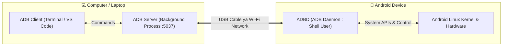
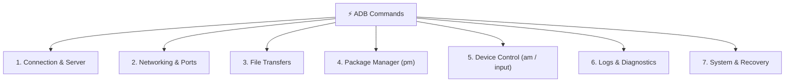

# ⚡ Awesome ADB in Hinglish (The Ultimate Visual Guide) 📱💻

<div align="center">

[](https://github.com/Rampravsh/awesome-adb-hinglish)
[](https://github.com/Rampravsh/awesome-adb-hinglish/network/members)
[](LICENSE)
[](CONTRIBUTING.md)
[](https://github.com/Rampravsh)

<br/>

**Android Debug Bridge (ADB) ko aasan Hinglish me seekhein — Zero se Hero tak!**  
*Visual Diagrams, Real-World Hacks, 1-Click Scripts aur Complete Cheatsheet ke sath.*

[🚀 Quickstart](#-1-minute-quickstart-installation) • [📊 Command Categories](#-adb-commands-ki-7-categories) • [🪄 1-Click Scripts](#-ready-to-use-1-click-scripts) • [📑 Cheatsheet](CHEATSHEET.md) • [🤝 Contribute](CONTRIBUTING.md)

</div>

---

## 🌟 Yeh Repo Kyun Khaas Hai?

Zyadatar documentation dry aur English jargon se bhari hoti hai. Yeh guide khas Indian developers, students aur Android enthusiasts ke liye design ki gayi hai:
- 💡 **Aasan Hinglish Bhasha** — Koi complex technical baatein nahi, seedha practical learning.
- 📊 **Flowcharts & Visual Diagrams** — Har workflow ke liye Mermaid diagrams.
- ⚡ **1-Click Automation Scripts** — Bloatware remover aur Wireless connector tools.
- 🎯 **Real World Hacks** — Screen broken data backup, webcam mode, fake battery prank, etc.

---

## 🗺️ Architecture: ADB Kaise Kaam Karta Hai?



---

## ⚡ 1-Minute Quickstart (Installation)

### Windows (Bina Android Studio ke - Sirf ~12 MB)
PowerShell me sirf yeh ek command chalayein:
```powershell
winget install Google.PlatformTools
```

### macOS / Linux
```bash
# Mac (Homebrew)
brew install android-platform-tools

# Ubuntu / Debian
sudo apt install adb fastboot
```

### Phone Setup:
1. **Settings** > **About Phone** > **Build Number** par 7 baar tap karein.
2. **Developer Options** me jaakar **USB Debugging** ko ON karein.
3. Phone ko USB se PC me lagayein aur screen par **"Always allow from this computer"** allow karein.
4. Verify karein:
   ```bash
   adb devices
   ```

---

## 📊 ADB Commands ki 7 Categories



---

### 1️⃣ Connection & Wireless Commands
| Kaam | Command |
| :--- | :--- |
| **Connected devices dekhna** | `adb devices` |
| **Bina Cable ke Wi-Fi se connect karna** | `adb tcpip 5555` fir `adb connect <PHONE_IP>:5555` |
| **Wireless connection todna** | `adb disconnect` |
| **ADB Server restart karna** | `adb kill-server` && `adb start-server` |

---

### 2️⃣ Networking & Port Forwarding (Web / Backend Devs)
| Kaam | Command |
| :--- | :--- |
| **PC ke `localhost:5000` ko phone se connect karna** | `adb reverse tcp:5000 tcp:5000` |
| **Phone ke port ko PC par forward karna** | `adb forward tcp:8080 tcp:8080` |
| **Active Port connections list karna** | `adb reverse --list` |

---

### 3️⃣ File Transfer Commands
| Kaam | Command |
| :--- | :--- |
| **PC se Phone me file bhejna** | `adb push myfile.pdf /sdcard/Download/` |
| **Phone se PC me photo/data lana** | `adb pull /sdcard/DCIM/Camera/photo.jpg C:\Users\` |
| **Toote phone se saari photos backup karna** | `adb pull /sdcard/DCIM/ C:\PhoneBackup\` |

---

### 4️⃣ Package Management Commands (`pm` - Apps Control)
| Kaam | Command |
| :--- | :--- |
| **Nayi App install karna** | `adb install app.apk` |
| **App uninstall karna** | `adb uninstall com.whatsapp` |
| **Saari installed apps dekhna** | `adb shell pm list packages` |
| **System Bloatware hatana (No Root)** | `adb shell pm uninstall -k --user 0 com.facebook.system` |
| **App ka data & cache saaf karna** | `adb shell pm clear com.instagram.android` |

---

### 5️⃣ Device Control & Automation (`am` & `input`)
| Kaam | Command |
| :--- | :--- |
| **Screen par tap / click karna** | `adb shell input tap 500 1200` |
| **Automatic text type karna** | `adb shell input text "ShikshaPlus"` |
| **Swipe / Scroll karna** | `adb shell input swipe 500 1500 500 500 300` |
| **Power / Lock Button** | `adb shell input keyevent 26` |
| **Home Button** | `adb shell input keyevent 3` |
| **Back Button** | `adb shell input keyevent 4` |
| **Chrome Browser Open Karna** | `adb shell am start -a android.intent.action.VIEW -d "http://localhost:5000"` |

---

### 6️⃣ Debugging & Diagnostics (Logs aur Battery)
| Kaam | Command |
| :--- | :--- |
| **Live System / App Errors dekhna** | `adb logcat *:E` |
| **Chrome Browser ke logs dekhna** | `adb logcat -s chromium` |
| **Log buffer clean karna** | `adb logcat -c` |
| **Battery status, temperature aur health** | `adb shell dumpsys battery` |
| **Fake Battery Level set karna (Prank/Testing)** | `adb shell dumpsys battery set level 10` |
| **PC par direct Screenshot lena** | `adb exec-out screencap -p > screenshot.png` |

---

### 7️⃣ System, Recovery & Flashing
| Kaam | Command |
| :--- | :--- |
| **Phone Restart karna** | `adb reboot` |
| **Recovery Mode me jana** | `adb reboot recovery` |
| **Fastboot / Bootloader Mode me jana** | `adb reboot bootloader` |
| **System Update flash karna** | `adb sideload update.zip` |

---

## 🪄 Ready-to-Use 1-Click Scripts

Is repository ke [`scripts/`](scripts/) folder me ready-made tools hain:

1. **`scripts/wireless_connect.bat`**  
   Sirf double click karein — yeh automatically aapke phone ka Wi-Fi IP detect karke wireless connect kar dega!
2. **`scripts/universal_debloater.bat`**  
   Xiaomi, Realme, Infinix, Samsung ke faltu ads aur bloatware ko safe tarike se disable karta hai.
3. **`scripts/take_screenshot.bat`**  
   1-Click me phone ki screen capture karke aapke PC Desktop par save karta hai.

---

## 📚 Deep Dive Modules

Detailed step-by-step guides ke liye modules padhein:
- [📖 Module 01: Installation & Driver Setup](modules/01-installation-and-setup.md)
- [📖 Module 02: Wireless Debugging (Bina Cable)](modules/02-wireless-debugging.md)
- [📖 Module 03: Bloatware Remover Master Guide](modules/03-bloatware-remover-guide.md)
- [📖 Module 04: Automation & Scripting Tricks](modules/04-device-automation-and-tricks.md)
- [📖 Module 05: Screen Mirroring & PC Webcam Guide](modules/05-pc-screen-mirroring-and-webcam.md)
- [📖 Module 06: Troubleshooting & Common Errors](modules/06-troubleshooting.md)

---

## 🤝 Contribution (Saath Judein!)

Agar aapke paas koi cool ADB command ya useful script hai:
1. Is repo ko **Fork** karein.
2. Apni command ya script add karein.
3. **Pull Request (PR)** submit karein!

Dekhein [CONTRIBUTING.md](CONTRIBUTING.md) guidance ke liye.

---

## 👨‍💻 Author & Maintainer

Created with ❤️ by **[Rampravesh Kumar](https://github.com/Rampravsh)**  
*Email: rampraveshkr4545@gmail.com*

---

## ⭐ Show Some Love
Agar is repository ne aapki madad ki hai, toh please top right me **Star ⭐** dabana na bhoolein! It means a lot!
