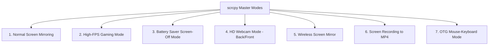

# 📖 Module 05: scrcpy Master Guide (Screen Mirroring, OTG & HD Webcam) 📱💻

<div align="center">

**`scrcpy` (Screen Copy) ke sath apne Android phone ko PC par 120 FPS me chalayein, mouse-keyboard se control karein, screen rotate karein aur phone ke camera ko DSLR-level HD Webcam banayein — Bina phone me koi app install kiye!**

</div>

---

## 🌟 `scrcpy` Kya Hai aur Itna Popular Kyun Hai?

`scrcpy` (by *Genymobile*) duniya ka sabse powerful aur fast open-source screen mirroring tool hai:
- ⚡ **Zero Lag / Ultra Low Latency**: Sirf 35ms - 70ms ka delay (Gaming aur live typing ke liye best).
- 🚀 **No App Required**: Phone me koi app/APK install nahi karni padti, yeh direct ADB se chalta hai.
- 🔄 **Easy Rotation**: 1-Click me phone ko Horizontal (Landscape) ya Vertical (Portrait) me rotate karein.
- 🔊 **Audio Forwarding**: Phone ka sound direct PC ke speaker/headphones me bajta hai (Android 11+).
- 🔋 **Screen-Off Mode**: Phone ki physical screen band rahegi aur battery bachegi, lekin PC par phone chalta rahega!
- 🎥 **HD Webcam Mode**: Phone ke high-quality back/front camera ko Zoom, Google Meet, Discord aur OBS ka webcam bana sakte hain.
- 📋 **Seamless Clipboard**: PC par `Ctrl+C` karein aur phone me direct `Ctrl+V` se paste karein.

---

## 🛠️ Installation & Setup

### Windows
PowerShell me run karein:
```powershell
winget install Genymobile.scrcpy
```

### macOS
```bash
brew install scrcpy
```

### Linux
```bash
sudo apt install scrcpy
```

---

## 🔄 Phone aur Camera ko Rotate Kaise Karein? (Vertical vs Horizontal)

Phone ke camera sensors natively sideways (horizontal) orientation me lage hote hain, isliye shuru me camera ya screen tedi dikh sakti hai. Isse theek karne ke **2 sabse aasan tarike** hain:

### Method 1: Live Keyboard Shortcut (Sabse Fast & Aasan) ⭐
Jab bhi `scrcpy` ya camera window khuli ho, keyboard par yeh dabayein:
* 👉 **`Alt + r`** — Screen / Camera ko **90° Rotate** kar dega (Har baar dabane par orientation change hogi: Portrait ↔ Landscape).
* 👉 **`Alt + Shift + r`** — Clockwise direction me 90° rotate karega.

---

### Method 2: Command me Direct Orientation Set Karna

#### 🎥 1. Webcam Mode me Vertical (Portrait) Camera Chalana:
```bash
# Back Camera ko seedha (Vertical / Portrait) chalana:
scrcpy --video-source=camera --orientation=90

# Front Selfie Camera ko seedha (Vertical) chalana:
scrcpy --video-source=camera --camera-facing=front --orientation=90
```

#### 🎥 2. Webcam Mode me Horizontal (Landscape / Widescreen) Chalana:
```bash
scrcpy --video-source=camera --camera-size=1920x1080 --orientation=0
```

#### 📱 3. Normal Phone Screen ko Force Landscape (Horizontal) me Lock Karna:
Gaming ya video dekhne ke liye agar phone ko hamesha Horizontal rakhna ho:
```bash
# 0 = Portrait (Khada) | 1 = Landscape (Leta hua) | 2 = Reverse Portrait | 3 = Reverse Landscape
scrcpy --lock-video-orientation=1
```

---

### ⚙️ Method 3: ADB Command se Phone ka Auto-Rotate Control Karna:
```bash
# Auto-Rotate ON karna
adb shell settings put system accelerometer_rotation 1

# Auto-Rotate OFF (Lock) karna
adb shell settings put system accelerometer_rotation 0

# Phone ko Force Portrait karna
adb shell settings put system user_rotation 0

# Phone ko Force Landscape (Horizontal) karna
adb shell settings put system user_rotation 1
```

---

## 🚨 OTG Mode: Mouse/Keyboard Lock & Release Master Guide

> **⚠️ BOHOT ZAROORI (Must Read Before Using OTG Mode):**  
> Jab aap `scrcpy --otg` chalate hain, toh PC aapke Mouse aur Keyboard ka **Hardware Level Control (HID)** phone ko de deta hai. Is wajah se cursor PC screen se gayab ho jata hai aur phone ke andar chala jata hai. **USB nikalne ki zaroorat nahi hai!**

### 🔓 Mouse & Keyboard ko Phone se Wapas PC me Kaise Layein?

| Action | Shortcut Key |
| :--- | :--- |
| **Mouse ko Phone se Release karke PC par lana** | **`Left Alt`** key ko **1 baar press** karein (Mouse wapas PC par aa jayega) |
| **Mouse ko wapas Phone ke andar bhejna** | `scrcpy` terminal window par click karein |
| **OTG Mode ko poora Band (Exit) karna** | Terminal me **`Ctrl + C`** dabayein ya `Alt + F4` |

---

### 🎮 OTG Mode me Kaunsi Key Kya Kaam Karti Hai? (Full Key Mapping)

#### 🖱️ Mouse Buttons ka Kaam:
* **Left Click**: Normal Touch / Tap karna.
* **Right Click**: ⬅️ **Back Button** dabana.
* **Middle Click (Scroll Wheel Click)**: 🏠 **Home Button** dabana (Home screen par jana).
* **Mouse Scroll Up / Down**: Page ko upar-neeche scroll karna.
* **Mouse Side Buttons (Agar Gaming Mouse ho)**: Recent Apps / App Switcher kholna.

#### ⌨️ Keyboard Keys ka Kaam:
| Keyboard Key | Phone me Kya Hoga? |
| :--- | :--- |
| **`Esc` (Escape)** | ⬅️ **Back Button** dabana |
| **`Windows` Key (Super Key)** | 🏠 **Home Screen** par jana ya Google Assistant kholna |
| **`Alt + Tab`** | 📑 **Recent Apps (App Switcher)** kholna |
| **`PrintScreen`** | 📸 Phone me **Screenshot** lena |
| **`Ctrl + C` / `Ctrl + V`** | Text **Copy / Paste** karna |
| **`Ctrl + A`** | Saara text select karna |
| **`Volume Up / Down / Mute` Keys** | Phone ki **Aawaz (Volume)** kam/zyada karna |
| **`Play / Pause / Next / Prev` Keys** | Phone ka **Music / Video** control karna |
| **`Sleep` / `Power` Key** | Phone ki Screen ko **Lock / Unlock** karna |

---

## 🚀 Top 7 Modes & Power Commands



---

### 1️⃣ Normal Screen Mirroring (Basic)
Phone ko USB se connect karein aur terminal me type karein:
```bash
scrcpy
```
*Aapke mouse se click/tap/scroll hoga aur PC keyboard se phone me typing hogi.*

---

### 2️⃣ Gaming & High Performance Mode (Low Latency + High FPS)
Agar aap Free Fire, BGMI ya koi game PC par khel rahe hain ya fast refresh rate chahte hain:
```bash
scrcpy --max-size=1080 --max-fps=120 --video-bit-rate=16M --stay-awake
```
- `--max-fps=120` : 120Hz refresh rate unlock karta hai.
- `--video-bit-rate=16M` : Crystal clear quality deta hai.
- `--stay-awake` : Phone ko sleep mode me nahi jaane deta.

---

### 3️⃣ Battery Saver Mode (Phone Display OFF, PC ON) ⭐
Jab aap PC se phone chalate hain, toh phone ki screen jalne se battery kharch hoti hai aur phone garam hota hai. Is command se **phone ki physical screen band ho jayegi**, lekin PC par full screen chalti rahegi:
```bash
scrcpy --turn-screen-off --stay-awake
```

---

### 4️⃣ Phone Camera ko PC Webcam Banana (DSLR Quality) 🎥

#### Back Camera (Vertical / Portrait - Reels & Zoom):
```bash
scrcpy --video-source=camera --orientation=90
```

#### Back Camera (Horizontal / Landscape - YouTube & OBS):
```bash
scrcpy --video-source=camera --camera-size=1920x1080 --orientation=0
```

#### Front Selfie Camera:
```bash
scrcpy --video-source=camera --camera-facing=front --orientation=90
```

---

### 5️⃣ Wireless Screen Mirroring (Bina USB Cable ke)
Phone aur PC same Wi-Fi par hone par:
```bash
# Step 1: USB connect karke port 5555 enable karein
adb tcpip 5555

# Step 2: Wi-Fi se connect karein (USB nikal dein)
adb connect 192.168.1.XX:5555

# Step 3: Wireless scrcpy chalayein
scrcpy --max-size=1080 --video-bit-rate=8M
```

---

### 6️⃣ Live Screen Recording to MP4 (PC Par Direct Save)
Phone ki screen ko bina watermark direct PC me HD `.mp4` me record karein:
```bash
scrcpy --record=my_gameplay.mp4
```
*(Screen band karne par video file aapke current folder me save ho jayegi).*

---

### 7️⃣ OTG Mode Command (Mouse & Keyboard Control)
```bash
scrcpy --otg
```
*(Mouse release karne ke liye **`Left Alt`** dabayein).*

---

## ⌨️ Screen Mirroring Mode ke Shortcuts (Window Open hone par)

| Shortcut | Kaam |
| :--- | :--- |
| **`Alt + r`** | Screen ya Camera ko **90° Rotate** karna (Vertical ↔ Horizontal) |
| **`Right Click`** | **Back Button** dabana |
| **`Middle Click`** (Scroll Wheel) | **Home Button** dabana |
| **`Alt + f`** | **Fullscreen** mode toggle karna |
| **`Alt + h`** | **Home Screen** par jana |
| **`Alt + b`** | **Back Button** dabana |
| **`Alt + s`** | **Recent Apps** switcher kholna |
| **`Alt + o`** | Phone ki **Physical Screen OFF** karna (PC par chalta rahega) |
| **`Alt + p`** | Phone ki **Physical Screen wapas ON** karna |
| **`Alt + n`** | **Notification Panel** neeche girana |
| **`Alt + Shift + n`** | **Quick Settings** panel kholna |
| **`Alt + v`** | PC ka copied text phone me **Paste** karna |
| **`Alt + Up / Down`** | Phone ka **Volume Badhana / Ghatana** |

---

## 📂 Drag-and-Drop Superpowers

`scrcpy` chalte waqt aap direct drag-and-drop kar sakte hain:
- **APK Install Karna:** PC se koi bhi `.apk` file utha kar `scrcpy` window par drag karein — app phone me direct install ho jayegi!
- **Files Bhejna:** Koi bhi PDF/Video/Photo drag karein — woh seedha phone ke `/sdcard/Download/` folder me chali jayegi.
