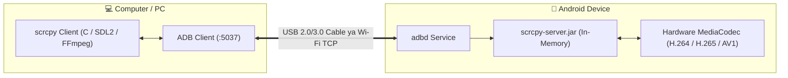

# 📘 Chapter 01: scrcpy Overview & Setup Guide 🚀

<div align="center">

**`scrcpy` (Screen Copy) by Genymobile: Android screen mirroring aur hardware control ka sabse powerful open-source tool.**

</div>

---

## 🌟 `scrcpy` Kya Hai aur Yeh Itna Fast Kyun Hai?

Zyadatar screen mirroring apps (jaise AnyDesk, TeamViewer ya Vysor) phone me ek heavy app chalati hain jo phone ko garam karti hai aur 200ms - 500ms ka lag (delay) deti hain.

`scrcpy` alag tareeke se kaam karta hai:
1. **No App on Phone**: Yeh phone me koi permanent app install nahi karta.
2. **Server-Jar Injection**: Yeh direct ADB ke through ek chhota sa Java server phone ke memory me temporarily inject karta hai.
3. **Direct Hardware Video Encoder (H.264 / H.265)**: Phone ke processor ka hardware encoder use karke direct video stream PC ko bhejta hai.
4. **Zero-Lag**: Iska latency sirf **35ms se 70ms** hota hai (Aankhon ko delay bilkul mehsoos nahi hota).

---

## 🗺️ Architecture Diagram



---

## 🛠️ Complete Installation Guide

### 1. Windows Setup (Easiest Method)
PowerShell open karein aur run karein:
```powershell
winget install Genymobile.scrcpy
```
*(Yeh automatically `scrcpy` aur zaroori video decoders download karke PATH me add kar deta hai).*

### 2. macOS Setup (Homebrew)
Terminal me run karein:
```bash
brew install scrcpy
```

### 3. Linux (Ubuntu / Debian / Arch)
```bash
# Ubuntu / Debian
sudo apt update && sudo apt install scrcpy

# Arch Linux
sudo pacman -S scrcpy
```

---

## 📱 Phone Readiness Checklist
1. Phone Settings > **About Phone** > **Build Number** par 7 baar tap karke **Developer Options** ON karein.
2. **USB Debugging** enable karein.
3. Phone ko USB se PC me lagakar **"Always allow from this computer"** approve karein.
4. Verify karein:
   ```bash
   adb devices
   ```

---

## ⚡ First Launch (Shuruat)
Terminal me sirf type karein:
```bash
scrcpy
```
Aapke PC par phone ki window khul jayegi! Mouse se tap karein aur keyboard se typing shuru karein.
