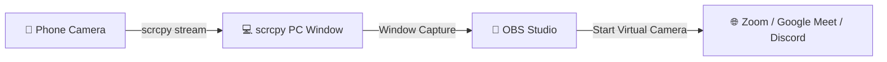

# 📘 Chapter 05: HD Webcam & Camera Streaming Guide 🎥

> **Phone ke High-Megapixel Camera ko PC ka DSLR-Level Webcam banayein (OBS, Zoom, Google Meet & Discord ke liye).**

---

## 🌟 Laptop Webcam vs Phone Camera
- Laptop ke in-built webcams 720p/1080p bohot low quality sensor ke hote hain.
- Aapke Android phone me 50MP/108MP ka high dynamic range sensor hota hai jo 10x better lighting aur crisp video deta hai.

---

## 🚀 1. Live Camera Commands

### 📸 Back Camera (Ultra HD 1080p 60 FPS):
```bash
scrcpy --video-source=camera --camera-size=1920x1080 --camera-fps=60
```

### 🤳 Front Camera (Selfie Mode):
```bash
scrcpy --video-source=camera --camera-facing=front --camera-size=1920x1080 --orientation=90
```

### 🔍 Camera List Dekhna (Phone me kaun-kaun se lenses hain):
```bash
scrcpy --list-cameras
```
*Isse Wide-angle, Macro aur Main camera ke Camera IDs list ho jayenge.*

### 🎯 Specific Lens Select Karna (Jaise Ultra-Wide ya 2x Telephoto):
```bash
scrcpy --video-source=camera --camera-id=2
```

---

## 🎛️ 2. OBS Studio me Virtual Camera Setup (Zoom / Meet ke liye)



1. **OBS Studio open karein.**
2. Sources me `+` click karein > **Window Capture** select karein.
3. Window me **`scrcpy`** select karein.
4. OBS me right-bottom corner par **"Start Virtual Camera"** button dabayein.
5. Zoom / Google Meet me video settings me camera choose karein: **"OBS Virtual Camera"**.
6. Boom! 🔥 Aapka DSLR-grade phone camera har app me live chalega.
